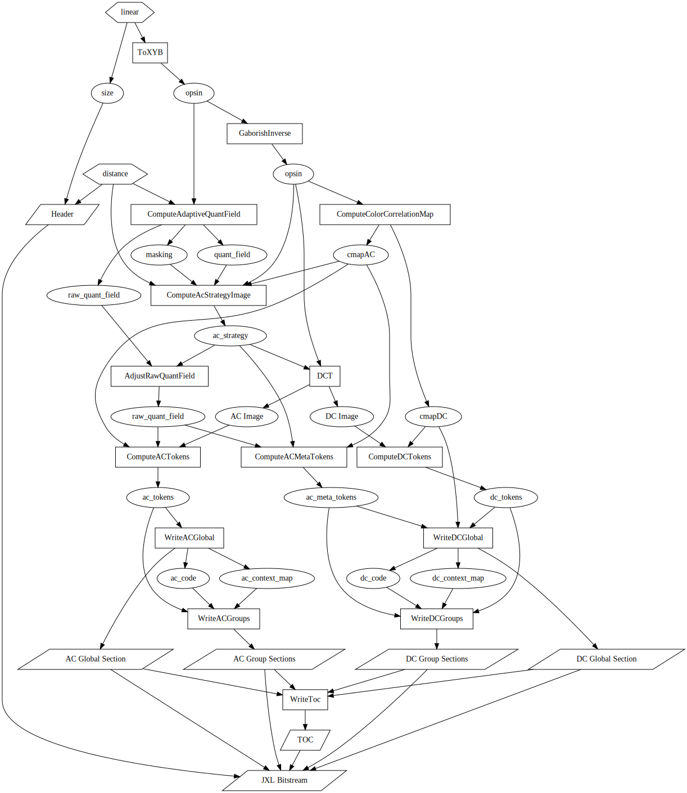

# Coding tools used in tiny encoder

The data dependency graph of the encoder is shown below.

The individual steps in the graph above are also sometimes simplified compared
to the full libjxl encoder, namely:

* Color correlation map: use only DCT8 and fast heuristics

* ACStrategy selection: use only 8x8, 8x16 and 16x8 transforms, use only
  aligned blocks

* DC coding: use fixed tree, gradient predictor, context based on gradient
  property

* AC quantization: no error diffusion

* AC context modeling: default block entropy context model

* AC tokenization: use only default coefficient order ("zig-zag")

* Entropy coding: only one uint coding scheme, no backward references, only ANS
  codes (with no histogram shifts)